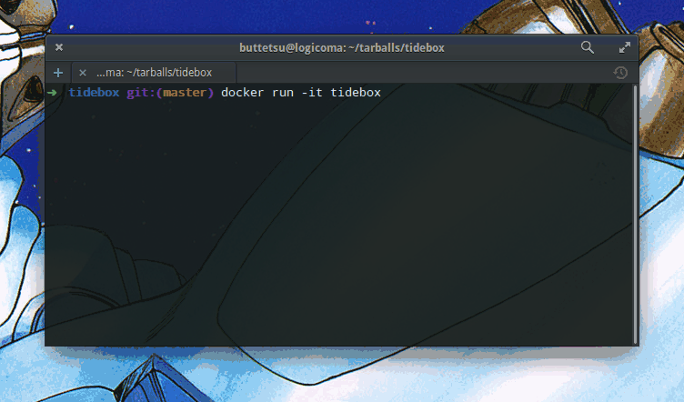

# Tidebox

[](https://quay.io/repository/doubledensity/tidebox)

> A complete Tidal musical live coding and audio streaming environment inside Docker

## What is Tidal?

According to the official [homepage](http://tidal.lurk.org):

"Tidal is a language for live coding pattern(s). It provides a way to express music with very flexible timing, providing a little language for describing patterns as discrete sequences (which can be polyphonic and polymetric), some generators of continuous patterns (e.g. sinewaves, sawtooths) and a wide range of pattern transformations."

Said differently, Tidal lets you rock out and explore sound and rhythm in real time from the context of a text editor.

If you are interested in more detail about the theory and execution of Tidal I highly suggest you read [this paper](https://raw.githubusercontent.com/yaxu/Tidal/master/doc/farm/farm.pdf) from its creator [Alex McLean](https://twitter.com/yaxu).

For an example of the types of patterns and techniques which are possible in Tidal, see the album [Expedition](https://kindohm.bandcamp.com/album/expedition) from [Kindohm](https://twitter.com/kindohm).

## Why Tidebox?

The goal of Tidebox is to allow anyone to run Tidal immediately on any available compute node and stream the output to any target. No package installation or configuration need. No sound hardware or elevated permissions are required on the Docker host.
This allows for the use of very-low end performance hardware to control and compose the session while harnessing greater resources on remote hosts, clusters and public cloud infrastructure.

Many thanks to Tidal and the entire live coding community for making such fun and exciting software!

## Getting started

First you will want to start the container:

```bash  
docker run -d quay.io/doubledensity/tidebox:0.2
```

Tidebox has been re-written for 0.2 so that it can now be run 'headless' as a detached Docker container and no longer requires an interactive terminal to run.

* After launching the container you can ssh in to it using the user name `tidal` and the password `livecoding` 

The Tidal session will begin automatically upon login. You can detach at any time from your session by using `CTRL-A-D`; Tidal will keep playing, and you can re-attach at any time by ssh'ing back in.

The FFserver process providing the audio stream is exposed on port 8090 and sshd is on port 22.



You can connect to the stream with any media player which supports streaming mp3 such as VLC, iTunes, MPlayer, mpg123, etc.

Here is an example of connecting to the stream with MPlayer: 

```bash    
mplayer http://172.17.0.2:8090/stream.mp3
```
* You may need to find the IP address of your Tidebox container using the Docker `inspect` command if you don't use the `--net=host` option    
    
By default Tidebox will start to play a test Tidal audio sequence automatically when you first login to the container so you can verify audio connectivity.

## Controls

The various components of Tidebox are running in separate windows within the GNU Screen terminal window manager, and should initialize automatically. 

The Emacs / Haskell Tidal environment is the default window `0`, but you can find the logs for the additional components JACK, Dirt, ffmpeg, and ffserver on windows `1-4`.

Window `5` is currently set aside as an interactive shell for working with and managing Tidal files or anything else you may wish to pull down or manipulate for use in your session.

You can switch between the Screen windows using `CTRL-,` and `CTRL-.` forward and backward, or `CTRL-A` followed by the default window numbers 1-5. 

## References

- [Tidal](http://tidal.lurk.org)
- [Dirt synth](https://github.com/tidalcycles/Dirt)
- [JACK Audio Connection Kit](http://www.jackaudio.org/)
- [FFmpeg](https://www.ffmpeg.org/)
- [GNU Emacs](https://www.gnu.org/software/emacs/)
- [GNU Screen](https://www.gnu.org/software/screen/)
- [TOPLAP The Home of Live Coding](http://toplap.org/)
- [Supervisor](http://supervisor.org)